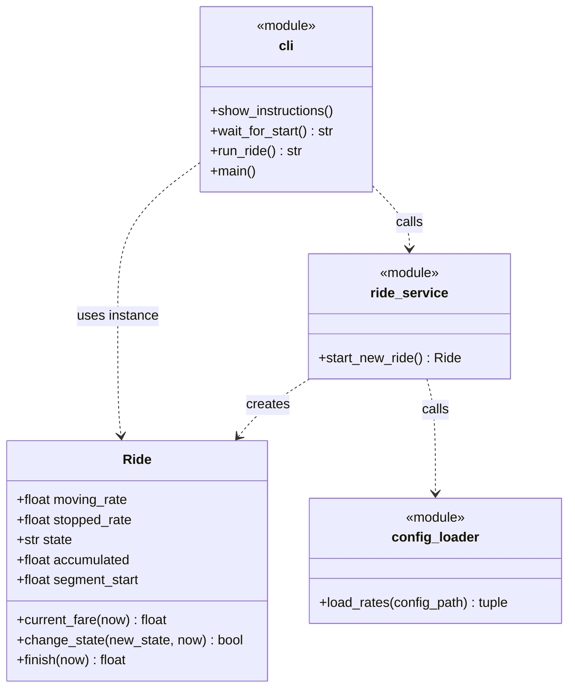
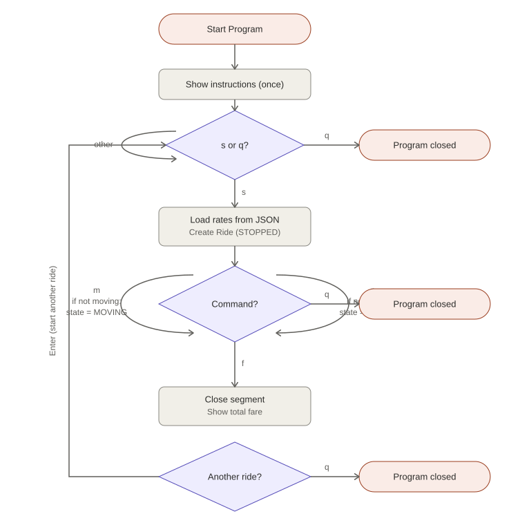

# 🚕 TaxiTech Solutions — Taximeter CLI


A terminal-based taximeter built in Python for the TaxiTech Solutions
challenge: it calculates a fare in real time based on the vehicle's
state (stopped / moving), driven entirely by keyboard commands, and
displays it live in euros with two decimals.

This project is developed **phase by phase**, each one adding a new
layer on top of Phase 1's validated fare logic — from a plain CLI to
persistence, a GUI, and finally a REST API with a database.

---

## 🔗 Project Links

- [Repository](https://github.com/davidlafuentem/project-py-taximetro)
- [Source code](./src/taximeter)
- [Tests](./tests)

---

## 🧭 Project Context

TaxiTech Solutions needs to validate its fare-calculation logic
before investing in any additional functionality. Phase 1 delivers a
fully operational CLI covering the complete lifecycle of a ride —
from starting the meter to charging the final amount — so that the
business logic can be signed off before a GUI or an API are built on
top of it.

---

## 📋 User Stories — Phase 1

| ID | User Story |
|----|------------|
| US-01 | As a driver, I want the app to explain how to use it as soon as it starts, so that I don't need external documentation. |
| US-02 | As a driver, I want to indicate at any moment whether the vehicle is stopped or moving, so that the fare reflects the real state of the ride. |
| US-03 | As a driver, I want the fare to accumulate continuously based on the vehicle's state and elapsed time, applying the correct rate to each segment. |
| US-04 | As a driver, I want to see the total amount to charge, in euros with two decimals, when I close the ride. |
| US-05 | As a driver, I want to start a new ride immediately after finishing one, without restarting the program. |

---

## 🎯 Project Objectives

- Validate the fare-calculation logic with a minimal, working CLI.
- Keep the domain logic (fare rules) completely decoupled from the
  terminal, so it can be reused by a GUI (Phase 3) or an API (Phase 4)
  without rewriting it.
- Externalize configurable values (fare rates) instead of hardcoding
  them.
- Cover the fare logic with automated tests using fixed, controlled
  time sequences.

---

## 🛠️ Tech Stack

- **Python 3.13** — standard library only (`threading`, `time`, `json`)
- **unittest** — automated testing of the domain layer
- **Git / GitHub** — `main` / `develop` / `feature/*` branching model

---

## 📁 Repository Structure

```
project-py-taximetro/
├── README.md
├── requirements.txt
├── .gitignore
├── config/
│   └── tarifas.json              # editable fare rates
├── src/
│   └── taximeter/
│       ├── main.py                        # entry point
│       ├── domain/
│       │   └── ride.py                    # Ride entity + fare rules
│       ├── application/
│       │   └── ride_service.py            # start_new_ride() use case
│       ├── infrastructure/
│       │   └── config_loader.py           # reads tarifas.json
│       └── interfaces/
│           └── cli.py                     # terminal I/O
├── logs/                          # reserved for Phase 2
└── tests/
    └── test_ride.py               # unit tests for Ride
```

---

## 🔎 Methodology — Key Design Decisions

### 1. Layered architecture (domain / application / infrastructure / interfaces)

Each layer has a single responsibility: `domain` holds pure fare
rules with no I/O, `application` coordinates use cases,
`infrastructure` reads external configuration, and `interfaces` is
the only layer that talks to the terminal. This lets the CLI be
swapped for a GUI or an API later without touching the fare logic.

### 2. Segment-based fare calculation, not a polling loop

Instead of summing the fare in a continuous loop, `Ride` records the
timestamp when each segment (stopped/moving) starts. When the state
changes or the ride finishes, it calculates
`elapsed_time × rate` for that segment and adds it to the total.
This avoids rounding drift and makes the logic trivial to unit test.

### 3. `Ride` receives time as a parameter

`Ride.current_fare(now)`, `change_state(new_state, now)` and
`finish(now)` all take the current time as an argument instead of
reading the system clock internally. This keeps the domain layer
free of side effects and lets tests run instantly with fixed
timestamps, instead of waiting for real seconds to pass.

### 4. Rates externalized in `config/tarifas.json`

Fare rates are not hardcoded — they're loaded at the start of each
ride through `infrastructure/config_loader.py`. Prices can change
without touching a single line of Python.

### 5. Incremental application of SOLID

Phase 1 applies **Single Responsibility** and, partially,
**Open/Closed** (new rates can be added without modifying `Ride`'s
internals). **Dependency Inversion** — abstracting the rate source
behind an interface — is intentionally left out until Phase 2/4,
when a second real implementation (API, database) makes that
abstraction worth its cost, rather than guessing at it upfront.

---

## 🗺️ Diagrams

### Class diagram



### Ride flow

> This diagram is rendered as a fixed image (not live Mermaid),
> because Mermaid's own renderer sizes itself unpredictably on
> GitHub for flowcharts this size. The image below has a fixed,
> compact display size.



<details>
<summary>Mermaid source (for editing — not rendered live)</summary>

```text
flowchart TD
    A((Start Program)) --> B[/Show instructions - once/]
    B --> C{s or q?}
    C -->|other| C
    C -->|q| Z1((Program closed))
    C -->|s| D[Load rates from JSON<br/>Create Ride - STOPPED]

    D --> E{Command}
    E -->|m| F{Already MOVING?}
    F -->|No| G[state = MOVING]
    G --> E
    F -->|Yes| E

    E -->|p| H{Already STOPPED?}
    H -->|No| I[state = STOPPED]
    I --> E
    H -->|Yes| E

    E -->|f| J[Close segment<br/>Show total fare]
    J --> K{Start another ride?}
    K -->|Enter| C
    K -->|q| Z2((Program closed))

    E -->|q| Z3((Program closed))
```

If you want to edit it, paste this into [mermaid.live](https://mermaid.live),
re-export as SVG, and overwrite `docs/diagrams/ride-flow.svg`.
</details>

---

## ▶️ Installation / Run Locally

```bash
git clone https://github.com/davidlafuentem/project-py-taximetro.git
cd project-py-taximetro/src
python3 -m taximeter.main
```

---

## 💻 Usage/Examples

| Command | Action |
|---------|--------|
| `s` | Start the ride (fare starts counting) |
| `m` | Vehicle switches to **MOVING** |
| `p` | Vehicle switches to **STOPPED** (waiting) |
| `f` | Finish the ride and show the total fare |
| `q` | Quit the program |

Fares applied in Phase 1:

- Moving: `0.05 €/second` (≈ €3.00/minute)
- Stopped: `0.02 €/second` (≈ €1.20/minute)

---

## ✅ Running Tests

```bash
cd src
python3 -m unittest discover -s ../tests -v
```

`tests/test_ride.py` verifies the fare calculation against fixed,
hand-computed scenarios (pure stopped/moving segments, mixed
sequences, repeated commands, idempotent reads) using controlled
timestamps — no need to wait for real seconds to pass.

---

## 🌱 Git Workflow

- `main` — validated, stable versions only.
- `develop` — active development for the current phase.
- `feature/*` — one branch per feature, merged into `develop` once
  it works; `develop` is merged into `main` once a phase is
  complete.
- Phases are tagged with semantic versioning:
  `v0.1.0-fase1`, `v0.2.0-fase2`, ... up to `v1.0.0` once all four
  phases are complete.

---

## 🚀 Roadmap

- [x] **Phase 1** — CLI with live fare calculation (this version)
- [ ] **Phase 2** — Persistent ride log, external config (done
      early), automated tests (started early)
- [ ] **Phase 3** — OOP refinement, password protection, tablet GUI
- [ ] **Phase 4** — REST API, database, web dashboard, one-command
      deployment

---

## 🧠 Skills Demonstrated

Python · Object-Oriented Design · Layered/Clean Architecture ·
Threading · Unit Testing (`unittest`) · JSON Configuration ·
Git Branching Strategy · Semantic Versioning · UML & Flow Diagramming

---

## 🙏 Acknowledgements

Challenge brief provided by **TaxiTech Solutions** as part of the
Factoria F5 program.

---

## 👤 Author

**David Lafuente Martín**
Data Analytics / Software Engineering Portfolio Project
